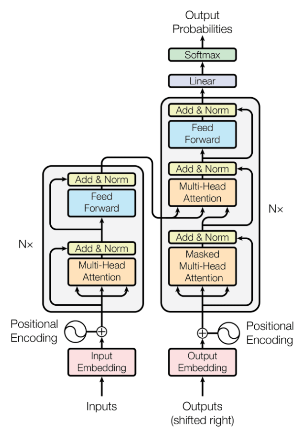

# GPT

## model structrue

transformer

GPT

## simple version
### picoGPT
- 参考：https://github.com/jaymody/picoGPT.git
- implemented by python
- [detail](./picoGPT/README.md)
- [blog](https://jaykmody.com/blog/gpt-from-scratch/), [chinese version](https://jiqihumanr.github.io/2023/04/13/gpt-from-scratch/)

### TinyGPT
- 参考：https://github.com/keith2018/TinyGPT.git
- implemented by C++ 
- [detail](./TinyGPT/README.md)
- [blog](https://robot9.me/write-gpt-from-scratch/)

## nanogpt
- 参考：https://github.com/karpathy/nanogpt
- implemented by python
- [nanogpt](./nanoGPT/README.md)